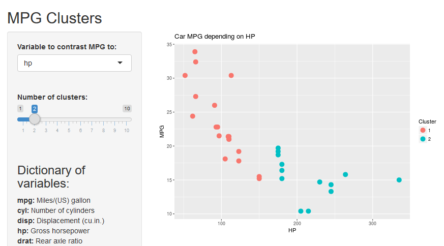

```{r setup, include=FALSE}
knitr::opts_chunk$set(echo = FALSE)
# Read the data
data(mtcars)
```

## Why Are Graphic EDA Apps Important?

EDA allow you to assess data by simply glancing or noticing a pattern in a graph.
Toy example on what very rudimentary exploration of individual fields(!) in the data without a graphic aspect on a *really* small dataset would look like: 

```{r, echo=T}
# Look at the number of variables and number of examples
print(dim(mtcars))

# Get a summary of the first few variables (all of them won't fit in the slide!)
summary(mtcars[2:5])
```

## Issues with this

- Nothing immediately jumps out at the analyst.
- Requires coding and computational power
- No graphic aspect means a lot of brain power has to be spent processing and interpreting results when they are not intuitive (most of the time)
- Time inefficient
- Relationships between variables are not at all apparent
- Customization requires extensive coding experience

### What would be better?

#### Contrast a dependent variable to various others individually and visually. 

#### Create and form as many clusters as fit to the data.

## Presenting: MPG Clusters



Intuitive controls and immediate interpretation of results. <https://imaginary.shinyapps.io/clusterTester/>

## How does it work?

`shiny` was used to create the interface and the server side processing.

It takes the input from the `selectInput` and the `slideInput` gadgets and runs `kmeans` using the selected inputs.

### Key Characteristics and Controls

- **Immediate feedback on changes to settings**: As soon as you're finished changing a setting you'll see the results reflected in your browser window.
- **Able to compare different variables**: You get to compare different variables to the dependent variable efforlessly.
- **Able to set the number of desired clusters**: Sometimes what's optimal isn't optimal to you! You get to decide what's best for your use case.

Code can be found at: <https://github.com/clinchergt/datasciencecoursera/tree/master/dataprods>

